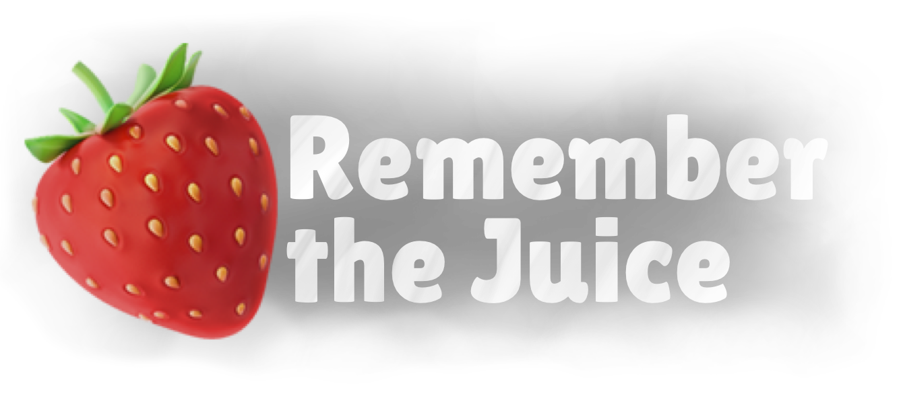
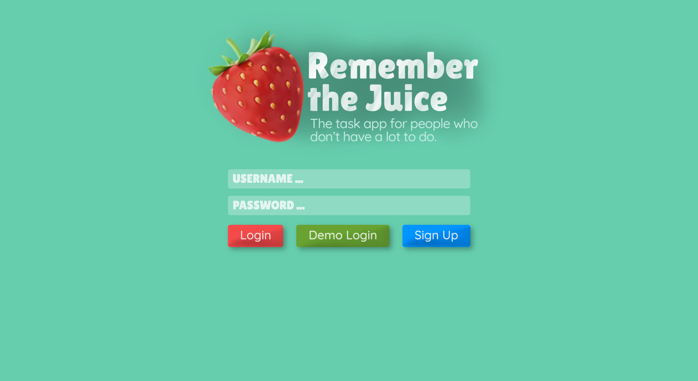
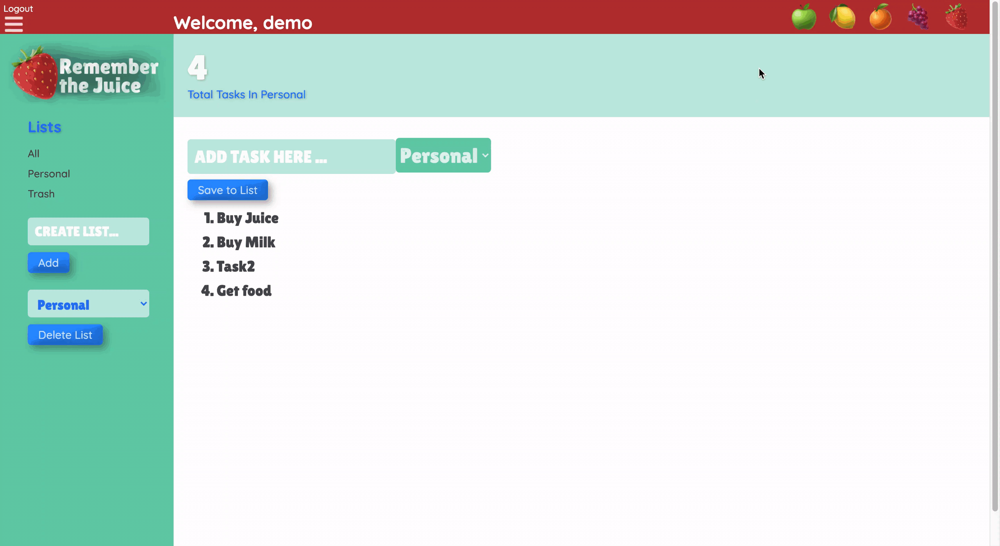

# Remember the Juice 🍓

 

  

  

    <b>Remember The Juice</b> - Inspired by Remember The Milk, Remember The Juice is a task app for people that don't have a lot to do.
     
     
    <a href="https://github.com/fairy-scary/remember-the-juice/wiki"><strong>Wiki docs »</strong></a>
     
     
    <a href="https://remember-the-juice.herokuapp.com/">Live Site</a>
  

   
Table of Contents

   <ol style='margin: 0px 30px 0px 0px'>
      <li>
         <a href="#about-the-project">About The Project</a>
         <ul>
            <li><a href="#project-description">Project Description</a></li>
            <li><a href="#technologies">Technologies</a></li>
         </ul>
      </li>
      <li><a href="#contact">Contact</a></li>
      <li><a href="#acknowledgements">Acknowledgements</a></li>
   </ol>

 

## About The Project

 

### Project Description

Remember The Juice is a Full Stack Web Application for users to organize their life by allowing easy creation and managagement of tasks / task lists. The app also features beautiful themes for users to choose from as a way to customize the app, and make it their own.

This application features a HTML, CSS frontend, rendered along with Pug.js, and AJAX for a dynamic frontend user experience. Express.js is used in the backend, which serves all data from the database.

 

   
Screenshots

   

      
      
   

 

### Technologies

 

| Technologies Used In This Project                    |                                              |
| ---------------------------------------------------- | -------------------------------------------- |
| [JavaScript](https://www.javascript.com/)            | [Express.js](https://expressjs.com/)         |
| [Pug.js](https://pugjs.org/api/getting-started.html) | [Heroku](https://heroku.com)                 |
| [CSS3](https://www.w3.org/Style/CSS/)                | [HTML5](https://en.wikipedia.org/wiki/HTML5) |
| [PostgreSQL](https://www.postgresql.org/)            | [Sequelize](https://sequelize.org/)          |
| [npm](https://www.npmjs.com/)                        | [Node.js](https://nodejs.org/en/)            |
|                                                      |                                              |

 
 

## Contact

Angelica Wilson - website: https://angelicawilson.com
 
Autumn Wiggins
 
Jung Park

Project Link: [https://github.com/fairy-scary/remember-the-juice](https://github.com/fairy-scary/remember-the-juice)

 

## Acknowledgements

- [App Academy](https://www.appacademy.io/)
- [Best-README-Template](https://github.com/othneildrew/Best-README-Template)
